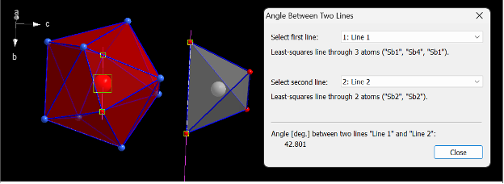

# Custom features

[](https://github.com/oliynyklab/Custom-features/blob/main/LICENSE)

This is a package that can generate custom features, essential for ML, especially for analyzing complex crystal structures. These features capture detailed geometric and structural information, such as polyhedron volumes, edge distortions, and atomic distances, focusing on specific sites. Researchers can better correlate material properties, such as conductivity and band gap, by tailoring features to structural nuances with their crystal environments. This approach is automated for high-throughput analysis, enabling the study of large datasets efficiently.

> The current README.md serves as a tutorial and documentation - last update January 28, 2025

## Inspiration

Features are the most essential component of any machine-learning study. Generating numerical information about the crystal structure could be done with generic featurizers (CAF and SAF links), however, once in a while, we need to generate a more specific features for an in-depth structural study.

Here we describe a custom feature approach with an example of Yb14MnSb11 structure adopting Ca14AlSb11-type structure, a known thermoelectric material. Custom features typically are applied for entries with the same type structure or entries that have similar structural elements. Tiny nuances of geometries can dramatically influence properties. Extracting custom features is an important step to correlate them with materials performance.

The structure is massive and it could be intimidating for a beginner.  It might be a challenge to know where to start in order to describe it without a priori knowledge or an extensive study of this specific structure type.


It might be a good idea to understand the structure from the point of view of the most symmetrical crystallographic sites (look for the smallest number and the earlies letter in Wyckoff symbols).  In our case we consider Mn (8a) and Sb4 (8b) sites and their environments.


Side note: It is also a great idea to study the compositions first to learn what atoms occupy certain sites. Fortunately, we have a [software](https://github.com/balaranjan/Site-Analysis) for that which helps you to quickly summarize and visualize site occupancies.

Custom features are tricky, since often you need to break the established solid state chemistry rules to construct the features you are interested in. For example, the coordination number of Mn in this structure is 12 according to d/dmin [CN method](https://github.com/bobleesj/structure-analyzer-featurizer), but to keep it conventional we will need to set it manually to CN=4.


We'll stick to CN=10 for Sb4 site identified in a conventional way.


With these coordination polyhedra, the complex structure of Yb14MnSb11 could be easily understood with Mn polyhedra (CN=4, Sb4) and Sb4 polyhedra (CN=10, Yb8Sb2) shown below.


Here are the custom features we can generate for the Ca14AlSb11-type structure.  In parentheses we number the features.  Keep in mind that we are working on a particular representative of the Ca14AlSb11-type structure, Yb14MnSb11.

Based on the Mn environment, we can calculate: (1) volume on this tetrahedron, (2) distance of Mn to the center of the mass of this polyhedron, (3) average of the edge length of this tetrahedron, (4) distortion of the edges calculated as the shortest edge divided by the longest edge.


Next, we can generate features based on the Sb4 environment.  Note, that is not always labeled as Sb4, we need to identify the site by Sb-Sb-Sb 180 degrees angle in this polyhedron.  (This Sb3 linear unit is also regarded as an interesting structural element by reports.)

Based on the Sb4 environment, we can calculate:  (5) volume of the polyhedron, (6) distance to the center of mass of this polyhedron, (7) distance from the central Sb to Yb1, (8) distance to Yb2, (9) average distance from the central atom to Yb, (10) shortest Sb-Yb to the longest Sb-Yb in this polyhedron, (11) distortion from the ideal square Yb2Yb1Yb2Yb1 - this could be calculated as the dihedral angle between the average plane through these four atoms and the plane between any three atoms.

We can also generate features that describe how the two polyhedra are arranged with respect to each other: (12) dihedral angles Yb2-Yb2 and Sb2-Sb2


(13) dihedral angles Sb1-Sb4-Sb1 and Sb2-Sb2



(14), (15), (16) more distance features that describe relative orientation of the polyhedral we selected.


Even more complex features: (17) plane between four atoms (same as bc plane) vs plane between any three out of four atoms, which are the closest of the four polyhedra.


This is an example of what custom features could be generated and the approach we take to extract this information.  What was demonstrated above is a tedious manual process which is automated and scaled for high-throughput CIF processing.  The extracted custom features will be used to correlate measured electrical conductivity, thermal conductivity, Seebeck coefficient, band gap, etc. of these materials.

## Demo

The attached [notebook](https://github.com/OliynykLab/Custom-features/blob/main/features.ipynb), has a walkthrough using the Yb14MnSb11.cif file. Feel free to substitute the cif file with one of your choosing and adjust the directory as needed.

## Installation

```bash
$ git clone https://github.com/oliynyklab/Custom-features
$ cd Custom-features
$ pip install -r requirements.txt
```

## Contributors

- [Sangjoon Bob Lee](https://github.com/bobleesj)
- [Balaranjan Selvaratnam](https://github.com/balaranjan)
- Anton Oliynyk
- [Emil Jaffal](https://github.com/EmilJaffal)

## How to ask for help

- If you have any issues or questions, please feel free to reach out or
  [leave an issue](https://github.com/oliynyklab/Custom-features/issues).